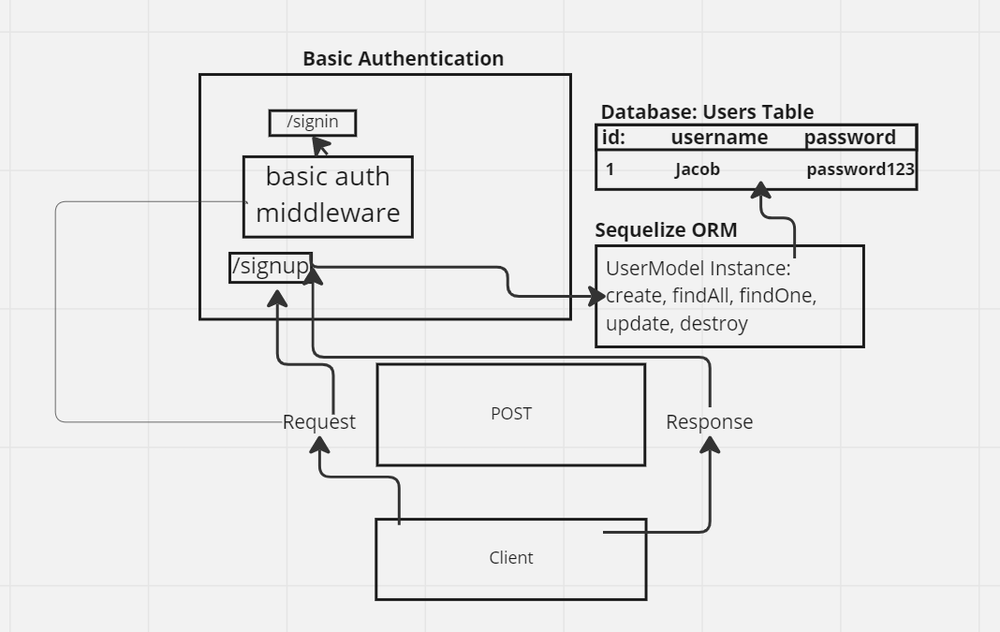

# LAB - Class 06

## Project: Basic Authentication

### Author: Jacob Dang

### Problem Domain
Set up and utilize Basic Auth with Express. There needs to be modularized code for the index.js & server.js as well as a folder called auth that contains 

### Links & Resources
{GitHub Actions} {URL}
{Deployed Database} {}

see '.env.sample'

### Features/Routes:
- Feature One:
    - POST: '/signup'
- Feature Two:
    - POST: '/signin'
    

#### Tests
- How do you run tests?
    - npm test

## UML
